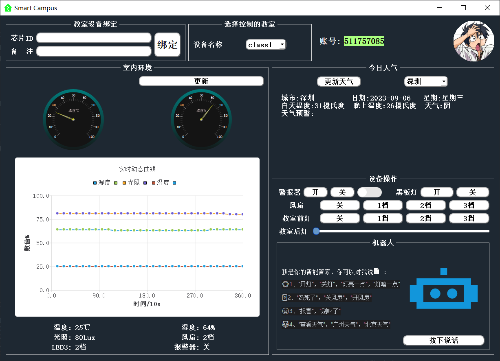
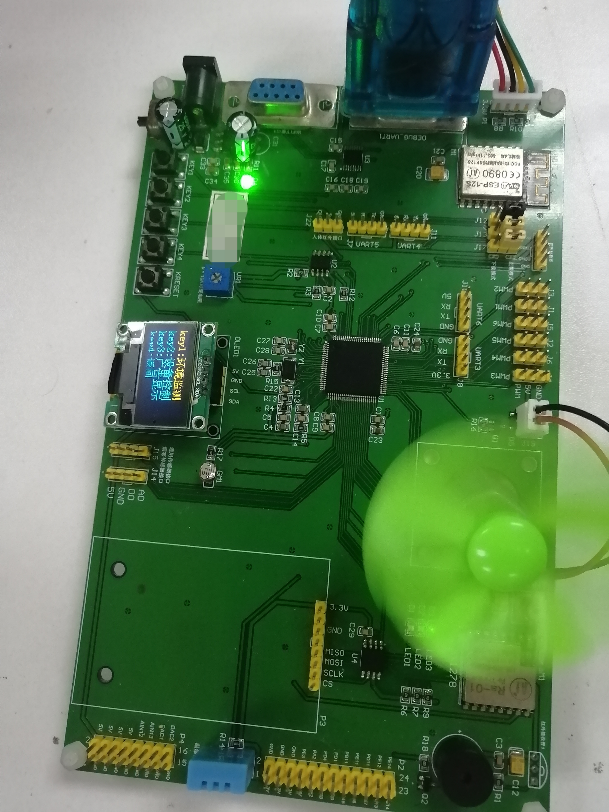

# Embedded-Integrated-Project
嵌入式综合项目：
  STM32F407基于ARM Cortex-M4处理器，QT5.9.9客户端，TCP、MQTT通信，JSON通信规则，云服务器Linux操作系统，MySQL数据存储转发。
#### QT客户端界面：
   
  
#### STM32开放板
  
  
### 下位机：
  STM32F407裸机开发：开发环境前提需要向ESP8266WIFI模块烧录带MQTT的SDK固件，控制部分有三个led、fan（PWM调节，定时器TIM控制）、beep,tem、hum（DHT11）在OLED显示屏（I2C）显示，并具有按键菜单，AT24C02(EEPROM)实现掉电保护。数据传输部分首先连接WIFI，再订阅自己ChipID的主题，上传时下位机发送的主题和上位机订阅主题一致（调试使用），MQTT服务器订阅下位机发送的主题信息，写入数据库；并且实现定时中断上传状态数据。下位机还需解析下传的ChipID主题的控制JSON数据。开发语言：C

### 上位机：
  QT同样也要加入mqtt开发库，导入pro工程文件，控制部分直接下发ChipID主题（实现了用户绑定式多设备控制的功能）消息控制设备，同时和服务器TCP通信抓取数据，更新显示状态，实现动态曲线图展示实时数据，外加语音识别功能，实现远程控制设备。http查询当地天气预报，可以切换城市，以及可扩展多媒体播放器，实现在线音乐播放（设计JSON解析）。开发语言：C++

### 服务器：
  分TCP服务端（同上位机通信）和MQTT服务端（同下位机通信）。MySQL数据库搭建，开启远程访问许可，建立多用户绑定设备数据表，和设备外设数据表。

### 最后：
  由于上位机和下位机开发语言有所差异，涉及到的相关函数接口各异，具体分析。
  下位机ESP8266和STM32需要实现串口转发，调试AT使得能够连上WIFI。
  上位机语音识别调取百度云API，JSON解析识别结果。

star star star!!!(第一次写完整个项目分享，感谢star支持)
                                          ----括号侠
